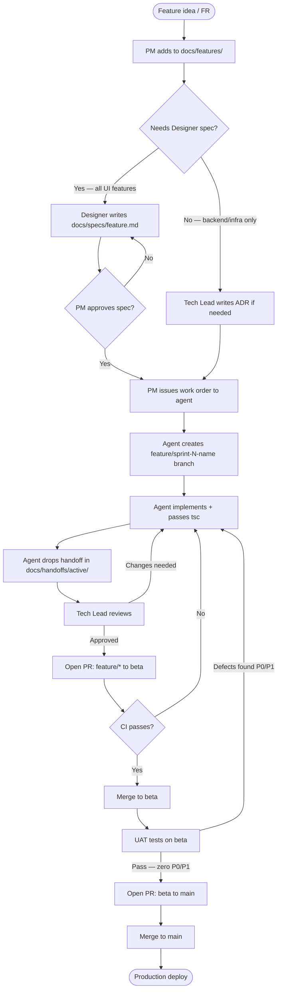
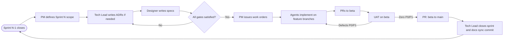
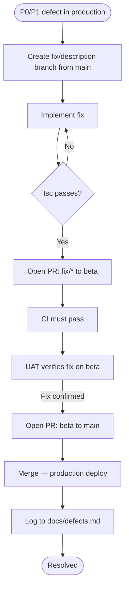

# DAWin — Development Workflow

**Status: Current**
**Last updated: 2026-05-28**

This document describes how features move from idea to production, how branches are used, how tests are run, and how deploys work. Every person — human or agent — joining this project should read this first.

---

## Branch Strategy

```
main          ← production (protected — PR required, CI must pass)
  └── beta    ← staging / integration testing (protected — CI must pass)
        └── feature/sprint-N-description   ← feature work
        └── fix/description                ← bug fixes
```

**Rules:**
- Nothing goes directly to `main` — ever. All changes arrive via PR from `beta`.
- Feature branches merge into `beta` first. Once tested, `beta` → `main` via PR.
- Hotfixes may go `fix/*` → `beta` → `main` in fast succession, but must pass CI and UAT.
- Branch names: `feature/sprint-9-recording`, `fix/sprint-8-ws-handler`, etc.

---

## Feature Development Flow



---

## Sprint Cycle



---

## Testing

### Running tests locally

```bash
# Run all unit tests (watch mode)
npm test

# Run once (for CI / pre-commit)
npm run test:run

# Visual test UI
npm run test:ui

# With coverage report
npm run test:coverage
```

### Test locations

```
tests/
  unit/
    utils/       -- pure functions: audio math, transport calculations
    server/      -- InMemoryStorageAdapter, route logic
  setup.ts       -- global setup (jest-dom matchers)
```

### What to test

| Type | Test | Where |
|---|---|---|
| Audio math | `faderToDb`, `fadeGain`, `formatDb`, peak calculation | `tests/unit/utils/audio.test.ts` |
| Storage adapter | All CRUD operations, edge cases, reset | `tests/unit/server/memory-adapter.test.ts` |
| New utility functions | Any pure function added to the codebase | `tests/unit/utils/` |

**What NOT to test** (at this stage): React component rendering, WebSocket event handling, Prisma queries against a real DB. These are covered by UAT and integration testing once the test suite matures.

### CI

Every push and PR runs:
1. `tsc --noEmit --noUnusedLocals --noUnusedParameters` (frontend + backend)
2. `npm run test:run` (all unit tests must pass)
3. `npm run build` (Vite build must succeed)

---

## Environments

| Environment | Branch | Frontend | Backend | Purpose |
|---|---|---|---|---|
| Local dev | any | `localhost:5173` | `localhost:3000` | Development |
| Beta / Staging | `beta` | Vercel beta URL | Railway staging | Integration testing before production |
| Production | `main` | Vercel production URL | Railway production | Live users |

See `docs/guides/deployment.md` for full setup instructions.

---

## Demo and Prototype Protections

Standalone HTML prototypes live in `public/`:
- `public/motion-prototypes/` — VU meter and startup animation prototypes
- `public/comps/` — early component explorations (waveform, plugin browser)

These are **read-only reference material**. Do not modify them — they document design decisions made before they were implemented. If you need a new prototype, create a new file; do not overwrite existing ones.

---

## Hotfix Flow



---

## Adding a New Agent to the Team

1. Read `handoff-documentation/DAWin_CURRENT_CONTEXT.md` — the single entry point
2. Read `STATUS.md` for current active work
3. Read `CLAUDE.md` for all project constraints and non-negotiable rules
4. Read `docs/process/sprint-close-protocol.md` for sprint process
5. Read this file (`docs/process/development-workflow.md`) for branch and deploy workflow
6. Do not start any work until you have read all five
